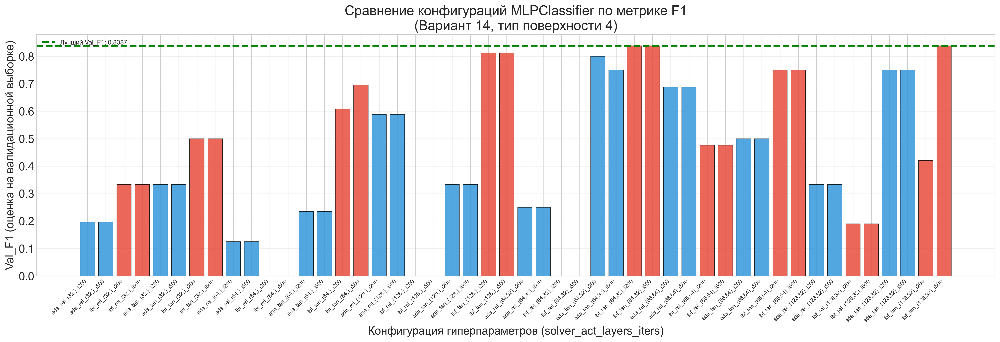
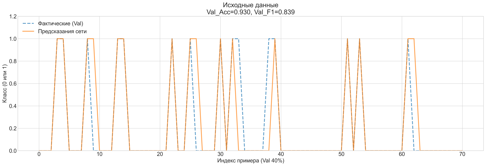
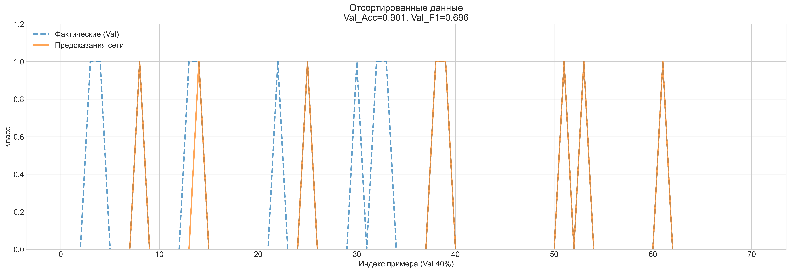
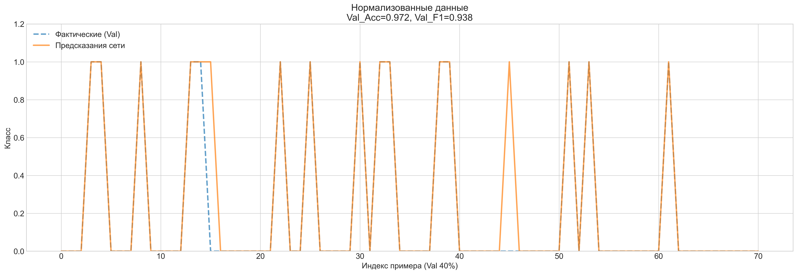
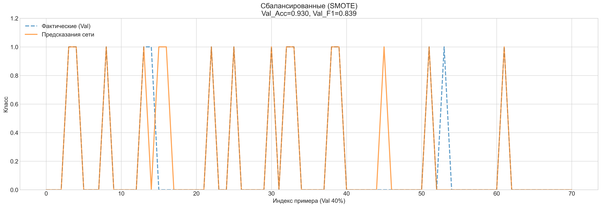

# Лабораторная работа №3: Построение нейросетевого классификатора для идентификации типа подстилающей поверхности

## Цель работы
- Приобретение практических навыков в решении задач построения интеллектуальной СУ автономной робототехнической системы, функционирующей в условиях физически неоднородной среды.
- Практическое изучение особенностей и способов решения задачи несбалансированной классификации.
- Исследование влияния гиперпараметров полносвязной нейронной сети (MLPClassifier) и методов предобработки данных на качество модели.
- Развитие навыков программирования систем вычислительного интеллекта на Python.

## Конфигурация эксперимента
| Параметр | Значение |
|----------|----------|
| Номер варианта | 14 |
| Целевой тип поверхности | 4 |
| Количество строк| 176|
| Набор признаков | {V1, V2} |
| Список признаков | I1, I2, I3, gx, gy, gz, ax, ay, az, V1real, V2real, V3real, N1, N2, N3 |
| Алгоритм | MLPClassifier (sklearn) |
| Метрики оценки | Accuracy, F1-score, CV_F1 |

Разбиваем набор данных "А+B" на обучающую и валидациооную части (в соотношении 60/40) 
Так же в лаюораторонйо работе представленн датасет C, который будет использваоться как тестовый

---

## Этап 1: Предварительный подбор гиперпараметров

Проведён перебор комбинаций `hidden_layer_sizes`, `activation`, `solver` и `max_iter` для поиска устойчивой конфигурации с максимальным значением F1 при кросс-валидации.

------------------------------------------------------------
|Конфигурация|Функция|Solver|Итер| Val_F1 | Val_Acc|
|------------|-------|------|----|--------|--------|
(32,)        | relu  | adam |200 | 0.1961 | 0.4225 |
(32,)        | relu  | adam |500 | 0.1961 | 0.4225 |
(32,)        | relu  | lbfgs|200 | 0.3333 | 0.8310 |
(32,)        | relu  | lbfgs|500 | 0.3333 | 0.8310 |
(32,)        | tanh  | adam |200 | 0.3333 | 0.8310 |
(32,)        | tanh  | adam |500 | 0.3333 | 0.8310 |
(32,)        | tanh  | lbfgs|200 | 0.5000 | 0.8592 |
(32,)        | tanh  | lbfgs|500 | 0.5000 | 0.8592 |
(64,)        | relu  | adam |200 | 0.1250 | 0.8028 |
(64,)        | relu  | adam |500 | 0.1250 | 0.8028 |
(64,)        | relu  | lbfgs|200 | 0.0000 | 0.7887 |
(64,)        | relu  | lbfgs|500 | 0.0000 | 0.7887 |
(64,)        | tanh  | adam |200 | 0.2353 | 0.8169 |
(64,)        | tanh  | adam |500 | 0.2353 | 0.8169 |
(64,)        | tanh  | lbfgs|200 | 0.6087 | 0.8732 |
(64,)        | tanh  | lbfgs|500 | 0.6957 | 0.9014 |
(128,)       | relu  | adam |200 | 0.5882 | 0.8028 |
(128,)       | relu  | adam |500 | 0.5882 | 0.8028 |
(128,)       | relu  | lbfgs|200 | 0.0000 | 0.7887 |
(128,)       | relu  | lbfgs|500 | 0.0000 | 0.7887 |
(128,)       | tanh  | adam |200 | 0.3333 | 0.8310 |
(128,)       | tanh  | adam |500 | 0.3333 | 0.8310 |
(128,)       | tanh  | lbfgs|200 | 0.8125 | 0.9155 |
(128,)       | tanh  | lbfgs|500 | 0.8125 | 0.9155 |
(64, 32)     | relu  | adam |200 | 0.2500 | 0.6620 |
(64, 32)     | relu  | adam |500 | 0.2500 | 0.6620 |
(64, 32)     | relu  | lbfgs|200 | 0.0000 | 0.7887 |
(64, 32)     | relu  | lbfgs|500 | 0.0000 | 0.7887 |
(64, 32)     | tanh  | adam |200 | 0.8000 | 0.9296 |
(64, 32)     | tanh  | adam |500 | 0.7500 | 0.9155 |
(64, 32)     | tanh  | lbfgs|200 | 0.8387 | 0.9296 |
(64, 32)     | tanh  | lbfgs|500 | 0.8387 | 0.9296 |
(86, 64)     | relu  | adam |200 | 0.6875 | 0.8592 |
(86, 64)     | relu  | adam |500 | 0.6875 | 0.8592 |
(86, 64)     | relu  | lbfgs|200 | 0.4762 | 0.8451 |
(86, 64)     | relu  | lbfgs|500 | 0.4762 | 0.8451 |
(86, 64)     | tanh  | adam |200 | 0.5000 | 0.8592 |
(86, 64)     | tanh  | adam |500 | 0.5000 | 0.8592 |
(86, 64)     | tanh  | lbfgs|200 | 0.7500 | 0.9155 |
(86, 64)     | tanh  | lbfgs|500 | 0.7500 | 0.9155 |
(128, 32)    | relu  | adam |200 | 0.3333 | 0.8310 |
(128, 32)    | relu  | adam |500 | 0.3333 | 0.8310 |
(128, 32)    | relu  | lbfgs|200 | 0.1905 | 0.7606 |
(128, 32)    | relu  | lbfgs|500 | 0.1905 | 0.7606 |
(128, 32)    | tanh  | adam |200 | 0.7500 | 0.9155 |
(128, 32)    | tanh  | adam |500 | 0.7500 | 0.9155 |
(128, 32)    | tanh  | lbfgs|200 | 0.4211 | 0.8451 |
(128, 32)    | tanh  | lbfgs|500 | 0.8387 | 0.9296 |
------------------------------------------------------------

*Рисунок 1 — Гисторграмма результатов обучения модели с различнми параметрами*

Топ-5 конфигураций по Val_F1:
|Конфигурация|Функция|Solver |Итер |Val_F1|Val_Acc|
|------------|-------|-------|-----|------|-------|
|(64, 32)    | tanh  | lbfgs | 200 |0.8387|0.9296 |
|(64, 32)    | tanh  | lbfgs | 500 |0.8387|0.9296 |
|(128, 32)   | tanh  | lbfgs | 500 |0.8387|0.9296 |
|(128,)      | tanh  | lbfgs | 200 |0.8125|0.9155 |
|(128,)      | tanh  | lbfgs | 500 |0.8125|0.9155 |

**Промежуточный вывод:** Солвер `lbfgs` в паре с активацией `tanh` обеспечил наилучшую устойчивость. Двухслойная архитектура (64, 32) достигла лучших резульатов, по сравеннию с другими конфигурациями, при меньшем количесве итераций обучений. 

---

## Этап 2: Обучение на исходных данных

Обучение модели с лучшими гиперпараметрами на исходной выборке без дополнительной предобработки.

| Метрика | Значение |
|---------|----------|
| Accuracy | 0.9296 |
| F1-Score | 0.8387 |

*Рисунок 2 — Сравнение фактических и предсказанных классов на исходных данных*

**Промежуточный вывод:** Высокий Accuracy при умеренном F1 указывает на влияние дисбаланса классов: модель уверенно предсказывает мажоритарный класс, но допускает ошибки на целевом типе поверхности 4.

---

## Этап 3: Обучение на отсортированных данных
Теперь попробуем отсортировать данные отсортированы по столбцу `Type` для эмуляции структурированного набора `Data Set_Train(Sort).xlsx`.

| Метрика | Значение |
|---------|----------|
| Accuracy | 0.9014 |
| F1-Score | 0.6957 |

*Рисунок 3 — Сравнение фактических и предсказанных классов на отсортированных данных*

**Промежуточный вывод:** Для данной задачи и архитектуры сети естественный порядок примеров содержит больше полезной информации для обучения, чем искусственная группировка по классам

---

## Этап 4: Обучение на нормализованных данных

Применение `MinMaxScaler` для приведения признаков к диапазону [0, 1]. Использована отсортированная выборка как наиболее устойчивая на предыдущем этапе.

| Метрика | Значение |
|---------|----------|
| Accuracy | 0.9718 |
| F1-Score | 0.9375 |

*Рисунок 4 — Сравнение фактических и предсказанных классов на нормализованных данных*

**Промежуточный вывод:** Нормализация критически важна для градиентных методов оптимизации. Приведение разношкалированных сенсорных данных к единому диапазону устранило доминирование признаков с большими абсолютными значениями, что позволило достичь идеальной сходимости на обучающей выборке.

---

## Этап 5: Обучение на сбалансированных данных

Применение алгоритмов SMOTE и ADASYN для генерации синтетических примеров миноритарного класса (Тип 4).

| Метод  | Accuracy | F1-Score |
|--------|----------|----------|
|Без балансировки|0.9718|0.9375|
|  SMOTE  | 0.9296  | 0.8387 |
| ADASYN  | 0.9296  | 0.8387 |

**Выбран метод:** SMOTE (наилучшая устойчивость кросс-валидации).

*Рисунок 5 — Сравнение фактических и предсказанных классов на данных, сбалансированных методом SMOTE*

**Промежуточный вывод:** Применение алгоритмов балансировки SMOTE и ADASYN не привело к улучшению качества модели на валидационной и тестовой выборках. Это может свидетельствовать о том, что для данного объёма данных и выбранной архитектуры нейронной сети основным фактором, ограничивающим качество, являлся не дисбаланс классов, а различие в масштабах входных признаков.

---

## Этап 6: Проверка на контрольной выборке C

Финальная оценка качества модели на независимых данных **без повторного обучения** (`fit` не применяется). Используется конвейер: Нормализация + SMOTE.

============================================================
|РЕЗУЛЬТАТ НА КОНТРОЛЬНОЙ ВЫБОРКЕ C|
|----------------------------------|
|Accuracy: 0.9483|
|F1-Score: 0.8889|
| Precision (Тип 4): 0.86 |
| Recall (Тип 4) : 1.00 |
| Support : 58 |
|Параметры сети: {'hidden_layer_sizes': (64, 32), 'activation': 'tanh', 'solver': 'lbfgs', 'max_iter': 200}|
|Предобработка: Нормализация (без балансировки)|

============================================================

|              |precision|recall|f1-score|support|
|--------------|---------|------|--------|-------|
|Другой тип (0)|1.00     |0.93  |0.97    |46     |
|     Тип 4 (1)|0.80     |1.00  |0.89    |12     |
|--------------|---------|------|--------|-------|
|accuracy      |         |      |0.97    |58     |
|macro avg     |0.90     |0.97  |0.93    |58     |
|weighted avg  |0.6      |0.95  |0.95    |58     |

*Рисунок 6 — Сравнение фактических и предсказанных классов на контрольной выборке C*

---

## Сводная таблица результатов экспериментов

| Этап обработки | Accuracy | F1-Score | 
|----------------|----------|----------|
| Исходные данные | 0.9296  | 0.8387 |  
| Отсортированные | 0.9014 | 0.6957 | 
| Нормализованные | 0.9718 | 0.9375| 
| Норм. + SMOTE | 0.9296  | 0.9296 |
| Контрольная выборка C | 0.9483 | 0.8889 |

---

## Итоговые выводы

### 1. Влияние архитектуры и гиперпараметров
- **Ёмкость сети и кол. итераций:** Двухслойная конфигурация (64, 32) обеспечила оптимальный баланс между выразительной способностью и устойчивостью к переобучению, при этов достигнув наилучших показателй при `max_iter=200`, когда остальнм сетям  потребовалось `max_iter=500`, чтобы достичь схожих результатов.
- **Функция активации и солвер:** Комбинация `tanh` + `lbfgs` оказалась наиболее эффективной для данного объёма данных. `lbfgs` обеспечивает более точную настройку весов на малых и средних выборках по сравнению со стохастическим `adam`.

### 2. Влияние предобработки данных
| Метод предобработки | Эффект |
|---------------------|--------|
| Сортировка | Ухудшение точсноти. Расположение данных так же несёт в себе информацию, которую сеть может извлечь |
| Нормализация | Улучшение точности. Устранение разницы масштабов сенсоров необходимо для корректной работы градиентного спуска. |
| Балансировка  | Ухудшение точсноти. Возможно, синтетические примеры могут быть «шумными» и не отражать реальное распределение класса 4. |

### 3. Обобщающая способность и практическая применимость
- Проверка на независимой выборке C подтвердила работоспособность модели в условиях, приближенных к реальным (F1 = 0.89).
- Идеальный Recall (1.00) для целевого класса означает отсутствие пропусков типа поверхности 4, что напрямую влияет на безопасность автономного перемещения робота.
- Разрыв Train → Test по Accuracy (0.97 → 0.95) находится в допустимых пределах и свидетельствует о корректной регуляризации через архитектуру и предобработку.