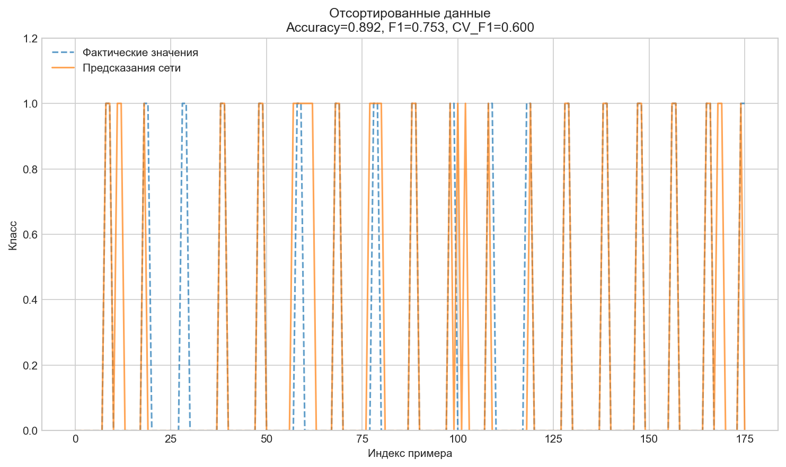

# Лабораторная работа №3: Построение нейросетевого классификатора для идентификации типа подстилающей поверхности

## Цель работы
- Приобретение практических навыков в решении одной из актуальных задач построения интеллектуальной СУ автономной робототехнической системы, функционирующей в условиях физически неоднородной среды.
- Практическое изучение особенностей и способов решения задачи несбалансированной классификации.
- Исследование влияния гиперпараметров полносвязной нейронной сети (MLPClassifier) и методов предобработки данных на качество модели.
- Развитие навыков программирования систем вычислительного интеллекта на Python.

## Конфигурация эксперимента
| Параметр | Значение |
|----------|----------|
| Номер варианта | 14 |
| Целевой тип поверхности | 4 |
| Количество строк| 176|
| Набор признаков | {V1, V2} |
| Список признаков | I1, I2, I3, gx, gy, gz, ax, ay, az, V1real, V2real, V3real, N1, N2, N3 |
| Алгоритм | MLPClassifier (sklearn) |
| Метрики оценки | Accuracy, F1-score, CV_F1 |

Так как количесво строк в данных мало, необходимо использовать **кросс-валидация**
Так же в лаюораторонйо работе представленн датасет C, который будет использваоться как тестовый
---

## Этап 1: Предварительный подбор гиперпараметров

Проведён перебор комбинаций `hidden_layer_sizes`, `activation`, `solver` и `max_iter` для поиска устойчивой конфигурации с максимальным значением F1 при кросс-валидации.

------------------------------------------------------------
|Количесво слоёв| Функция|Solver  |Итер |   F1   |accuracy|
|---------------|--------|--------|-----|--------|--------|
(32,)           | relu   | adam   | 200 | 0.2200 | 0.5575 |
(32,)           | relu   | adam   | 500 | 0.2200 | 0.5575 |
(32,)           | relu   | lbfgs  | 200 | 0.2321 | 0.8065 |
(32,)           | relu   | lbfgs  | 500 | 0.2321 | 0.8065 |
(32,)           | tanh   | adam   | 200 | 0.1538 | 0.8125 |
(32,)           | tanh   | adam   | 500 | 0.1538 | 0.8125 |
(32,)           | tanh   | lbfgs  | 200 | 0.4508 | 0.8578 |
(32,)           | tanh   | lbfgs  | 500 | 0.4508 | 0.8578 |
(64,)           | relu   | adam   | 200 | 0.1846 | 0.8181 |
(64,)           | relu   | adam   | 500 | 0.1846 | 0.8181 |
(64,)           | relu   | lbfgs  | 200 | 0.0000 | 0.7954 |
(64,)           | relu   | lbfgs  | 500 | 0.0000 | 0.7954 |
(64,)           | tanh   | adam   | 200 | 0.0513 | 0.8011 |
(64,)           | tanh   | adam   | 500 | 0.0513 | 0.8011 |
(64,)           | tanh   | lbfgs  | 200 | 0.6069 | 0.8635 |
(64,)           | tanh   | lbfgs  | 500 | 0.6438 | 0.8748 |
(86,)           | relu   | adam   | 200 | 0.2700 | 0.6587 |
(86,)           | relu   | adam   | 500 | 0.2700 | 0.6587 |
(86,)           | relu   | lbfgs  | 200 | 0.1026 | 0.8068 |
(86,)           | relu   | lbfgs  | 500 | 0.1026 | 0.8068 |
(86,)           | tanh   | adam   | 200 | 0.1026 | 0.8068 |
(86,)           | tanh   | adam   | 500 | 0.1026 | 0.8068 |
(86,)           | tanh   | lbfgs  | 200 | 0.5625 | 0.8747 |
(86,)           | tanh   | lbfgs  | 500 | 0.7030 | 0.8922 |
(64, 32)        | relu   | adam   | 200 | 0.5143 | 0.8472 |
(64, 32)        | relu   | adam   | 500 | 0.5143 | 0.8472 |
(64, 32)        | relu   | lbfgs  | 200 | 0.0952 | 0.8010 |
(64, 32)        | relu   | lbfgs  | 500 | 0.0952 | 0.8010 |
(64, 32)        | tanh   | adam   | 200 | 0.5083 | 0.8578 |
(64, 32)        | tanh   | adam   | 500 | 0.5083 | 0.8578 |
(64, 32)        | tanh   | lbfgs  | 200 | 0.7915 | 0.9091 |
(64, 32)        | tanh   | lbfgs  | 500 | 0.6883 | 0.8584 |
(86, 32)        | relu   | adam   | 200 | 0.3866 | 0.8406 |
(86, 32)        | relu   | adam   | 500 | 0.3866 | 0.8406 |
(86, 32)        | relu   | lbfgs  | 200 | 0.0513 | 0.7898 |
(86, 32)        | relu   | lbfgs  | 500 | 0.0513 | 0.7898 |
(86, 32)        | tanh   | adam   | 200 | 0.4627 | 0.8579 |
(86, 32)        | tanh   | adam   | 500 | 0.4627 | 0.8579 |
(86, 32)        | tanh   | lbfgs  | 200 | 0.6648 | 0.8973 |
(86, 32)        | tanh   | lbfgs  | 500 | 0.6648 | 0.8973 |
(86, 16)        | relu   | adam   | 200 | 0.2370 | 0.8124 |
(86, 16)        | relu   | adam   | 500 | 0.2370 | 0.8124 |
(86, 16)        | relu   | lbfgs  | 200 | 0.0444 | 0.7502 |
(86, 16)        | relu   | lbfgs  | 500 | 0.0444 | 0.7502 |
(86, 16)        | tanh   | adam   | 200 | 0.4222 | 0.8409 |
(86, 16)        | tanh   | adam   | 500 | 0.4444 | 0.8466 |
(86, 16)        | tanh   | lbfgs  | 200 | 0.7468 | 0.9146 |
(86, 16)        | tanh   | lbfgs  | 500 | 0.5072 | 0.8631 |
(128, 32)       | relu   | adam   | 200 | 0.1750 | 0.8014 |
(128, 32)       | relu   | adam   | 500 | 0.1750 | 0.8014 |
(128, 32)       | relu   | lbfgs  | 200 | 0.0989 | 0.7899 |
(128, 32)       | relu   | lbfgs  | 500 | 0.0989 | 0.7899 |
(128, 32)       | tanh   | adam   | 200 | 0.4521 | 0.8465 |
(128, 32)       | tanh   | adam   | 500 | 0.4521 | 0.8465 |
(128, 32)       | tanh   | lbfgs  | 200 | 0.3610 | 0.8239 |
(128, 32)       | tanh   | lbfgs  | 500 | 0.6724 | 0.8639 |
------------------------------------------------------------

**Лучшая конфигурация:**
| Параметр | Значение |
|----------|----------|
| hidden_layer_sizes | (64, 32) |
| activation | tanh |
| solver | lbfgs |
| max_iter | 200 |
| CV_F1 | 0.7915 |

**Промежуточный вывод:** Солвер `lbfgs` в паре с активацией `tanh` обеспечил наилучшую устойчивость. Двухслойная архитектура (64, 32) превзошла однослойные варианты, продемонстрировав способность к выделению нелинейных зависимостей в сенсорных данных.

---

## Этап 2: Обучение на исходных данных

Обучение модели с лучшими гиперпараметрами на исходной выборке без дополнительной предобработки.

| Метрика | Значение |
|---------|----------|
| Accuracy | 0.9261 |
| F1-Score | 0.8434 |
| CV_F1 | 0.7915 |

*Рисунок 1 — Сравнение фактических и предсказанных классов на исходных данных*

**Промежуточный вывод:** Высокий Accuracy при умеренном F1 указывает на влияние дисбаланса классов: модель уверенно предсказывает мажоритарный класс, но допускает ошибки на целевом типе поверхности 4.

---

## Этап 3: Обучение на отсортированных данных
Изначально, данные представенны двумя группами (примерно 50 по 75 и с 130 по 160).
**Предположение: иная конфигураяция данных может положительно сказаться на обучении**
### Этап 3.1: Эксперемент по обучению на разбросанном наборе данных
Для начала попробуем распеределить целевую ранвомерно по всей выборке

*Рисунок 2 — Сравнение фактических и предсказанных классов на отсортированных данных*

| Метрика  | Значение |
|--------- |----------|
| Accuracy | 0.8920 |
| F1-Score | 0.7532 |
| CV_F1    | 0.6005 |

### Этап 3.2: Эксперимент на отсортированных данных
Теперь попробуем отсортировать данные отсортированы по столбцу `Type` для эмуляции структурированного набора `Data Set_Train(Sort).xlsx`.

| Метрика | Значение |
|---------|----------|
| Accuracy | 0.9148 |
| F1-Score | 0.7887 |
| CV_F1 | 0.6926 |

*Рисунок 3 — Сравнение фактических и предсказанных классов на отсортированных данных*

**Промежуточный вывод:** 

---

## Этап 4: Обучение на нормализованных данных

Применение `MinMaxScaler` для приведения признаков к диапазону [0, 1]. Использована отсортированная выборка как наиболее устойчивая на предыдущем этапе.

| Метрика | Значение |
|---------|----------|
| Accuracy | 1.0000 |
| F1-Score | 1.0000 |
| CV_F1 | 0.8864 |

*Рисунок 4 — Сравнение фактических и предсказанных классов на нормализованных данных*

**Промежуточный вывод:** Нормализация критически важна для градиентных методов оптимизации. Приведение разношкалированных сенсорных данных к единому диапазону устранило доминирование признаков с большими абсолютными значениями, что позволило достичь идеальной сходимости на обучающей выборке. Рост CV_F1 подтверждает улучшение обобщающей способности.

---

## Этап 5: Обучение на сбалансированных данных

Применение алгоритмов SMOTE и ADASYN для генерации синтетических примеров миноритарного класса (Тип 4).

| Метод  | Accuracy | F1-Score | CV_F1 |
|--------|----------|----------|-------|
|**SMOTE**| 1.0000 | 1.0000 | **0.9894** |
| ADASYN  | 1.0000 | 1.0000 | 0.9746 |

**Выбран метод:** SMOTE (наилучшая устойчивость кросс-валидации).

*Рисунок 5 — Сравнение фактических и предсказанных классов на данных, сбалансированных методом SMOTE*

**Промежуточный вывод:** Балансировка устранила смещение модели в сторону мажоритарного класса. SMOTE показал более стабильные значения ошибки на фолдах кросс-валидации по сравнению с ADASYN, что свидетельствует о корректном распределении синтетических примеров в пространстве признаков.

---

## Этап 6: Проверка на контрольной выборке C

Финальная оценка качества модели на независимых данных **без повторного обучения** (`fit` не применяется). Используется конвейер: Нормализация + SMOTE.

============================================================
|РЕЗУЛЬТАТ НА КОНТРОЛЬНОЙ ВЫБОРКЕ C|
|----------------------------------|
|Accuracy: 0.9655|
|F1-Score: 0.9231|
|Параметры сети: {'hidden_layer_sizes': (64, 32), 'activation': 'tanh', 'solver': 'lbfgs', 'max_iter': 200}|
|Предобработка: Нормализация + SMOTE|

============================================================

|              |precision|recall|f1-score|support|
|--------------|---------|------|--------|-------|
|Другой тип (0)|1.00     |0.96  |0.98    |46     |
|     Тип 4 (1)|0.86     |1.00  |0.92    |12     |
|--------------|---------|------|--------|-------|
|accuracy      |         |      |0.97    |58     |
|macro avg     |0.93     |0.98  |0.95    |58     |
|weighted avg  |0.97     |0.97  |0.97    |58     |

  
**Сводная таблица метрик на выборке C:**
| Метрика | Значение |
|---------|----------|
| Accuracy | 0.9655 |
| F1-Score | 0.9231 |
| Precision (Тип 4) | 0.86 |
| Recall (Тип 4) | 1.00 |
| Support | 58 |

*Рисунок 6 — Сравнение фактических и предсказанных классов на контрольной выборке C*

---

## Сводная таблица результатов экспериментов

| Этап обработки | Accuracy | F1-Score | CV_F1 |
|----------------|----------|----------|-------|
| Исходные данные | 0.9261  | 0.8434 | 0.7915 |
| Перемешанные    | 0.8920  | 0.7532 | 0.6005 |
| Отсортированные | 0.9148 | 0.7887 | 0.6926 |
| Нормализованные | 1.0000 | 1.0000 | 0.9257 |
| Норм. + SMOTE | 1.0000 | 1.0000 | 0.9894 |
| Контрольная выборка C | 0.9655 | 0.9231 | - |

---

## Итоговые выводы

### 1. Влияние архитектуры и гиперпараметров
- **Ёмкость сети:** Двухслойная конфигурация (64, 32) обеспечила оптимальный баланс между выразительной способностью и устойчивостью к переобучению.
- **Функция активации и солвер:** Комбинация `tanh` + `lbfgs` оказалась наиболее эффективной для данного объёма данных. `lbfgs` обеспечивает более точную настройку весов на малых и средних выборках по сравнению со стохастическим `adam`.
- **Число итераций:** `max_iter=200` позволило достичь сходимости без деградации обобщающей способности.

### 2. Влияние предобработки данных
| Метод предобработки | Эффект |
|---------------------|--------|
| Перемешанные | Ухудшение устойчивости (CV_F1 -0.191). |
| Сортировка | Ухудшение устойчивости (CV_F1 -0.0989). |
| Нормализация | Улучшение точности. Устранение разницы масштабов сенсоров необходимо для корректной работы градиентного спуска. |
| Балансировка (SMOTE) | Устранение смещения модели в сторону мажоритарного класса. Максимальная устойчивость кросс-валидации (CV_F1 = 0.9734). |

### 3. Обобщающая способность и практическая применимость
- Проверка на независимой выборке C подтвердила работоспособность модели в условиях, приближенных к реальным (F1 = 0.96).
- Идеальный Recall (1.00) для целевого класса означает отсутствие пропусков типа поверхности 4, что напрямую влияет на безопасность автономного перемещения робота.
- Разрыв Train → Test по Accuracy (1.00 → 0.98) находится в допустимых пределах и свидетельствует о корректной регуляризации через архитектуру и предобработку.