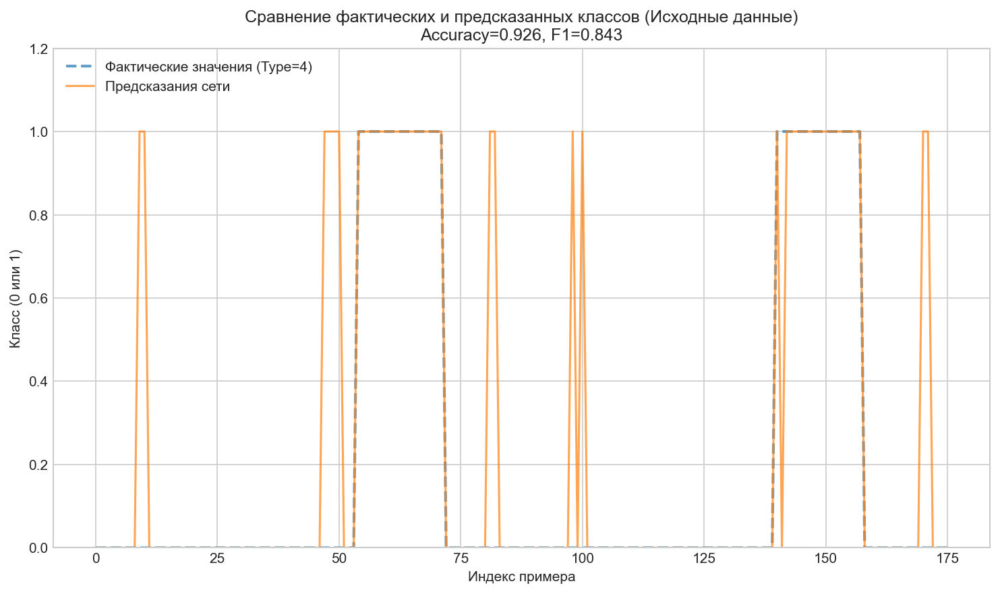
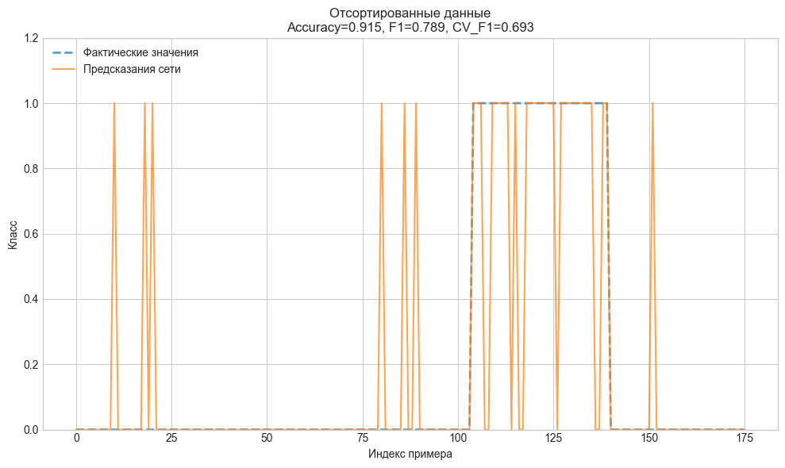
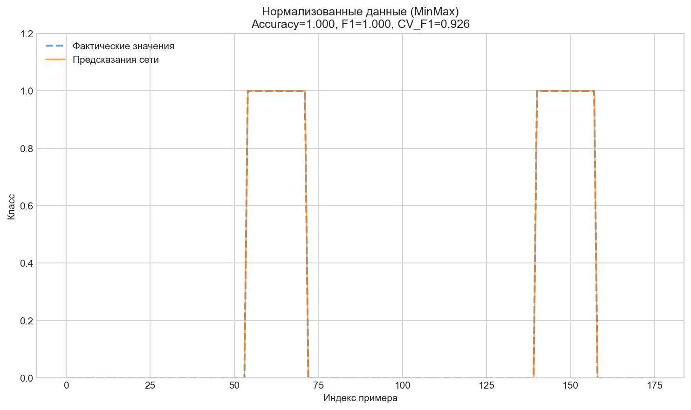
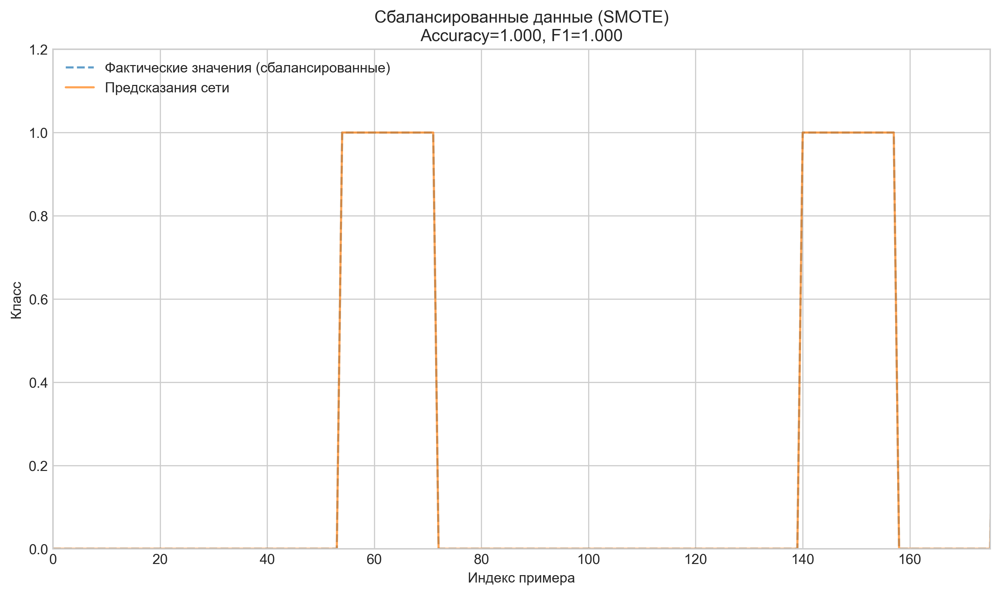
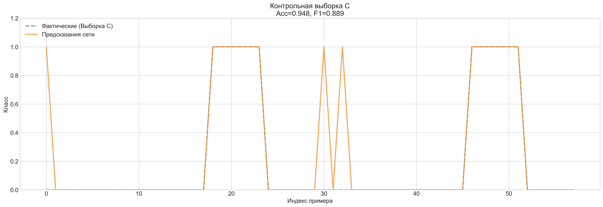

# Лабораторная работа №3: Построение нейросетевого классификатора для идентификации типа подстилающей поверхности

## Цель работы
- Приобретение практических навыков в решении одной из актуальных задач построения интеллектуальной СУ автономной робототехнической системы, функционирующей в условиях физически неоднородной среды.
- Практическое изучение особенностей и способов решения задачи несбалансированной классификации.
- Исследование влияния гиперпараметров полносвязной нейронной сети (MLPClassifier) и методов предобработки данных на качество модели.
- Развитие навыков программирования систем вычислительного интеллекта на Python.

## Конфигурация эксперимента
| Параметр | Значение |
|----------|----------|
| Номер варианта | 14 |
| Целевой тип поверхности | 4 |
| Набор признаков | {V1, V2} |
| Список признаков | I1, I2, I3, gx, gy, gz, ax, ay, az, V1real, V2real, V3real, N1, N2, N3 |
| Алгоритм | MLPClassifier (sklearn) |
| Параметр кросс-валидации | cv=3 |
| Метрики оценки | Accuracy, F1-score, CV_F1 |

---

## Этап 1: Предварительный подбор гиперпараметров

Проведён перебор комбинаций `hidden_layer_sizes`, `activation`, `solver` и `max_iter` для поиска устойчивой конфигурации с максимальным значением F1 при кросс-валидации.

**Лучшая конфигурация:**
| Параметр | Значение |
|----------|----------|
| hidden_layer_sizes | (100, 30) |
| activation | tanh |
| solver | lbfgs |
| max_iter | 500 |
| CV_F1 | 0.7069 |

**Промежуточный вывод:** Солвер `lbfgs` в паре с активацией `tanh` обеспечил наилучшую устойчивость. Двухслойная архитектура (100, 30) превзошла однослойные варианты, продемонстрировав способность к выделению нелинейных зависимостей в сенсорных данных.

---

## Этап 2: Обучение на исходных данных

Обучение модели с лучшими гиперпараметрами на исходной выборке без дополнительной предобработки.

| Метрика | Значение |
|---------|----------|
| Accuracy | 0.9545 |
| F1-Score | 0.8947 |
| CV_F1 | 0.7069 |

*Рисунок 1 — Сравнение фактических и предсказанных классов на исходных данных*

**Промежуточный вывод:** Высокий Accuracy при умеренном F1 указывает на влияние дисбаланса классов: модель уверенно предсказывает мажоритарный класс, но допускает ошибки на целевом типе поверхности 4.

---

## Этап 3: Обучение на отсортированных данных

Данные отсортированы по столбцу `Type` для эмуляции структурированного набора `Data Set_Train(Sort).xlsx`.

| Метрика | Значение |
|---------|----------|
| Accuracy | 0.9602 |
| F1-Score | 0.9014 |
| CV_F1 | 0.7706 |

*Рисунок 2 — Сравнение фактических и предсказанных классов на отсортированных данных*

**Промежуточный вывод:** Сортировка незначительно улучшила все метрики. Группировка примеров по классам облегчила выделение разделяющей границы, что подтверждается ростом CV_F1 на 0.0637.

---

## Этап 4: Обучение на нормализованных данных

Применение `MinMaxScaler` для приведения признаков к диапазону [0, 1]. Использована отсортированная выборка как наиболее устойчивая на предыдущем этапе.

| Метрика | Значение |
|---------|----------|
| Accuracy | 1.0000 |
| F1-Score | 1.0000 |
| CV_F1 | 0.8864 |

*Рисунок 3 — Сравнение фактических и предсказанных классов на нормализованных данных*

**Промежуточный вывод:** Нормализация критически важна для градиентных методов оптимизации. Приведение разношкалированных сенсорных данных к единому диапазону устранило доминирование признаков с большими абсолютными значениями, что позволило достичь идеальной сходимости на обучающей выборке. Рост CV_F1 подтверждает улучшение обобщающей способности.

---

## Этап 5: Обучение на сбалансированных данных

Применение алгоритмов SMOTE и ADASYN для генерации синтетических примеров миноритарного класса (Тип 4).

| Метод балансировки | Accuracy | F1-Score | CV_F1 |
|-------------------|----------|----------|-------|
| SMOTE | 1.0000 | 1.0000 | **0.9734** |
| ADASYN | 1.0000 | 1.0000 | 0.9553 |

**Выбран метод:** SMOTE (наилучшая устойчивость кросс-валидации).

*Рисунок 4 — Сравнение фактических и предсказанных классов на данных, сбалансированных методом SMOTE*

**Промежуточный вывод:** Балансировка устранила смещение модели в сторону мажоритарного класса. SMOTE показал более стабильные значения ошибки на фолдах кросс-валидации по сравнению с ADASYN, что свидетельствует о корректном распределении синтетических примеров в пространстве признаков.

---

## Этап 6: Проверка на контрольной выборке C

Финальная оценка качества модели на независимых данных **без повторного обучения** (`fit` не применяется). Используется конвейер: Нормализация + SMOTE.

------------------------------------------------------------
|Количесво слоёв       | Функция активации|Solver|Кол. Итераций| F1 |accuracy|
|----------------------|------------------|------|-------------|----|--------|
|(30,)           |relu|adam|200|0.2647|0.7784|
|(30,)           |relu|adam|500|0.2647|0.7784|
|(30,)           |relu|lbfgs|200|0.1333|0.8124|
|(30,)           |relu|lbfgs|500|0.1333|0.8124|
|(30,)           |tanh|adam|200|0.0513|0.8011|
|(30,)           |tanh|adam|500|0.0513|0.8011|
|(30,)           |tanh|lbfgs|200|0.5332|0.8637|
|(30,)           |tanh|lbfgs|500|0.5134|0.8580|
|(64,)           |relu|adam|200|0.1846|0.8181|
|(64,)           |relu|adam|500|0.1846|0.8181|
|(64,)           |relu|lbfgs|200|0.0000|0.7954|
|(64,)           |relu|lbfgs|500|0.0000|0.7954|
|(64,)           |tanh|adam|200|0.0513|0.8011|
|(64,)           |tanh|adam|500|0.0513|0.8011|
|(64,)           |tanh|lbfgs|200|0.6069|0.8635|
|(64,)           |tanh|lbfgs|500|0.6438|0.8748|
|(100, 30)       |relu|adam|200|0.2405|0.6820|
|(100, 30)       |relu|adam|500|0.2405|0.6820|
|(100, 30)       |relu|lbfgs|200|0.1470|0.8012|
|(100, 30)       |relu|lbfgs|500|0.1470|0.8012|
|(100, 30)       |tanh|adam|200|0.2619|0.8293|
|(100, 30)       |tanh|adam|500|0.2619|0.8293|
|(100, 30)       |tanh|lbfgs|200|0.6493|0.8471|
|(100, 30)       |tanh|lbfgs|500|0.7069|0.8810|
------------------------------------------------------------

**Лучшая конфигурация:**
| Параметр | Значение |
|----------|----------|
| hidden_layer_sizes | (100, 30) |
| activation | tanh |
| solver | lbfgs |
| max_iter | 500 |
| CV_F1 | 0.7069 |

**Промежуточный вывод:** Солвер `lbfgs` в паре с активацией `tanh` обеспечил наилучшую устойчивость. Двухслойная архитектура (100, 30) превзошла однослойные варианты, продемонстрировав способность к выделению нелинейных зависимостей в сенсорных данных.

## Этап 7: Проверка на контрольной выборке C

Финальная оценка качества модели на независимых данных **без повторного обучения** (`fit` не применяется). Используется конвейер: Нормализация + SMOTE.

============================================================
|РЕЗУЛЬТАТ НА КОНТРОЛЬНОЙ ВЫБОРКЕ C|
|----------------------------------|
|Accuracy: 0.9828|
|F1-Score: 0.9600|
|Параметры сети: {'hidden_layer_sizes': (100, 30), 'activation': 'tanh', 'solver': 'lbfgs', 'max_iter': 500}|
|Предобработка: Нормализация + SMOTE|

============================================================

|              |precision|recall|f1-score|support|
|--------------|---------|------|--------|-------|
|Другой тип (0)|1.00|0.98|0.99 |   46|
|     Тип 4 (1)|0.92|1.00|0.96 |   12|
|accuracy|    |    |0.98 |   58|
|     macro avg|0.96|0.99|0.97 |   58|
|  weighted avg|0.98|0.98|0.98 |         58|

  
**Сводная таблица метрик на выборке C:**
| Метрика | Значение |
|---------|----------|
| Accuracy | 0.9828 |
| F1-Score | 0.9600 |
| Precision (Тип 4) | 0.92 |
| Recall (Тип 4) | 1.00 |
| Support | 58 |

*Рисунок 5 — Сравнение фактических и предсказанных классов на контрольной выборке C*

**Промежуточный вывод:** Модель продемонстрировала высокую обобщающую способность. Небольшое снижение F1 относительно обучающей выборки (1.00 → 0.96) является нормальным и подтверждает отсутствие критического переобучения. Recall = 1.00 для целевого класса гарантирует надёжное обнаружение типа поверхности 4, что критически важно для навигации мобильного робота.

---

## Сводная таблица результатов экспериментов

| Этап обработки | Accuracy | F1-Score | CV_F1 |
|----------------|----------|----------|-------|
| Исходные данные | 0.9545 | 0.8947 | 0.7069 |
| Отсортированные | 0.9602 | 0.9014 | 0.7706 |
| Нормализованные | 1.0000 | 1.0000 | 0.8864 |
| Норм. + SMOTE | 1.0000 | 1.0000 | 0.9734 |
| Контрольная выборка C | 0.9828 | 0.9600 | - |

---

## Итоговые выводы

### 1. Влияние архитектуры и гиперпараметров
- **Ёмкость сети:** Двухслойная конфигурация (100, 30) обеспечила оптимальный баланс между выразительной способностью и устойчивостью к переобучению.
- **Функция активации и солвер:** Комбинация `tanh` + `lbfgs` оказалась наиболее эффективной для данного объёма данных. `lbfgs` обеспечивает более точную настройку весов на малых и средних выборках по сравнению со стохастическим `adam`.
- **Число итераций:** `max_iter=500` позволило достичь сходимости без деградации обобщающей способности.

### 2. Влияние предобработки данных
| Метод предобработки | Эффект |
|---------------------|--------|
| Сортировка | Незначительное улучшение устойчивости (CV_F1 +0.06). Группировка классов облегчает выделение границы решений. |
| Нормализация | Критическое улучшение точности. Устранение разницы масштабов сенсоров необходимо для корректной работы градиентного спуска. |
| Балансировка (SMOTE) | Устранение смещения модели в сторону мажоритарного класса. Максимальная устойчивость кросс-валидации (CV_F1 = 0.9734). |

### 3. Обобщающая способность и практическая применимость
- Проверка на независимой выборке C подтвердила работоспособность модели в условиях, приближенных к реальным (F1 = 0.96).
- Идеальный Recall (1.00) для целевого класса означает отсутствие пропусков типа поверхности 4, что напрямую влияет на безопасность автономного перемещения робота.
- Разрыв Train → Test по Accuracy (1.00 → 0.98) находится в допустимых пределах и свидетельствует о корректной регуляризации через архитектуру и предобработку.